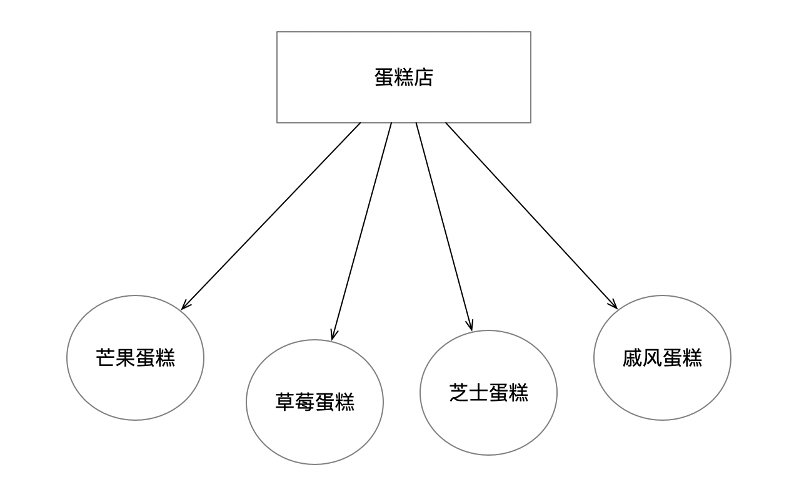
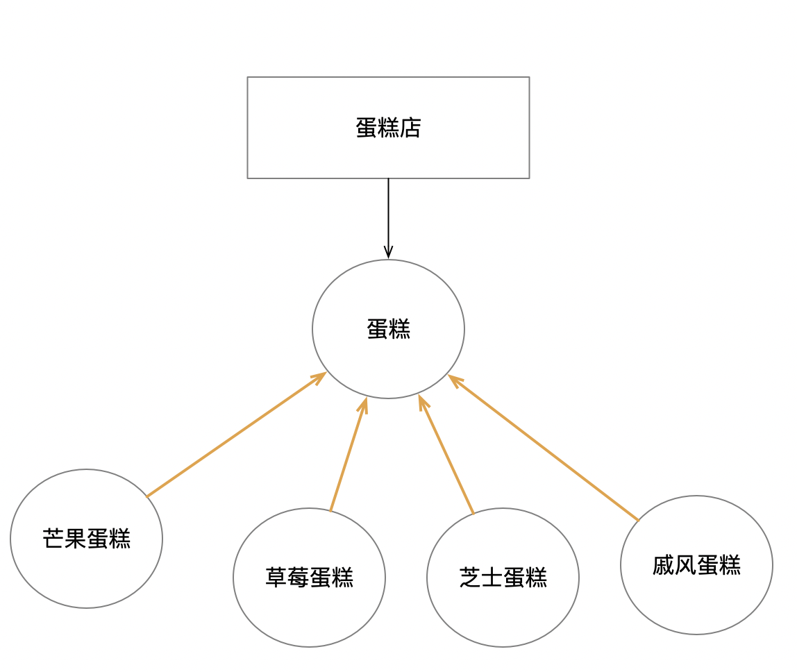

# 写在前面

## 学习目的

我认为通往高级Java工程师的道路上，至少要有两个工具，一个是JVM，另一个就是设计模式。设计模式有助于我们阅读源码，便于理解框架的设计思想，另外，还有助于我们写出高质量的代码。

## 学习反思

这不是我第一次学习设计模式，反思之前的学习经历，基本是“看了，忘了；忘了，再看；再看，再忘……”。为什么会是这种无效的学习？我觉得一方面是学习方法不对，另一方面，设计模式本身应用灵活，不是固定的知识。一般的教程把设计模式教成了模板，Demo是基于一般化的设计。

> 在学习一般化的设计后，还可以收集一些JDK中的实际应用，来理解模式的变体；另外还可以结合实际的项目案例，重构一下自己的项目

## 如何学习

不要死记硬背模式的结构，模式不是模板，模式可以灵活变化的。

1. 模式要解决的背后的问题是什么？

2. 模式的实现方案为什么能解决这个（类）问题？

> 对比使用模式前后的代码结构，有助于理解模式带来的好处

## 学习前的准备-设计原则

### 单一职责原则

高内聚，一类应该只做一件事情

### 开闭原则

对扩展开放，对修改关闭。就是说新增新功能不用修改原来的代码

### 里氏替换原则

用父类的地方同样能用子类来完成，其实就是多态的应用

### 依赖倒置原则

上层模块不要依赖下层模块，应该依赖于抽象；抽象不应该依赖于细节，一节依赖于抽象。

这个重点是**抽象**，不能理解为是面向接口编程，虽然他们很像。

现在的结构，不同蛋糕的修改是否都会涉及到蛋糕店的修改？继续看下面的结构图：

现在，都依赖于抽象**“蛋糕”**，不管蛋糕怎么变，我是不是就不需要装修蛋糕店了。

### 接口隔离原则

使用专门的接口，使功能最小化，不要定义自己不需要的接口。

### 迪米特原则

做好封装，不该被人了解的就不要让他们知道，只暴露需要暴露的就行