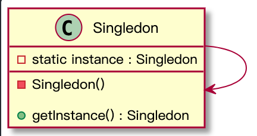

# 单例模式
## 意图
单例模式能够保证一个类只有一个实例，并提供一个访问实例的全局访问节点。
## 问题
1. 保证一个类只有一个实例。**为什么想要控制实例的数量？**
2. 为该实例提供全局的访问节点。**和普通的全局变量对比有什么好处？**
> 对于普通全局变量，我们可以在任何地方都有可能覆盖它，非常不安全。而单例保证一个类只有一个实例，而且除了单例类以外，无法通过其他方式替换该缓存实例，从而更好的保护全局数据。

**多线程环境下，需要特别处理，避免多线程多次创建实例。**
## 结构
  

## 代码示例
#### 饿汉模式
```Java
public class HungerSingletonDemo {
    //写法一
    //public static HungerSingletonDemo instance = new HungerSingletonDemo();

    //写法二
    public static HungerSingletonDemo instance;

    static {
        instance = new HungerSingletonDemo();
    }
    //写法二（end）
    private HungerSingletonDemo(){

    }

    public static HungerSingletonDemo getInstance(){
        return instance;
    }
}
```

#### 懒汉模式
饿汉模式是在类加载时完成类初始化，以方便使用。但是这样容易造成不必要的开销，比如：类初始化非常耗时，再或者，类初始化后，实例根本没用到。针对这些问题，我们希望实现懒加载。


首先，看一下非线程安全的实现
```Java
public class LazySingletonDemo {

    //对应一般写法，non-safe
    public static LazySingletonDemo instance;

    public String value;
    private LazySingletonDemo(String value){
        //为了验证线程不安全
        try {
            Thread.sleep(1000);
        } catch (InterruptedException ex) {
            ex.printStackTrace();
        }
        this.value = value;
    }

    /**
     * 一般写法：非线程安全，
     * @param value
     * @return
     */
    public static LazySingletonDemo getInstance(String value){
        if(instance == null){
            instance = new LazySingletonDemo(value);
        }
        return instance;
    }

    //该方法解决序列化-反序列化破坏单例的问题
    private Object readResolve(){
        return instance;
    }
}
```

**为什么是非线程安全的？**  
首先看一下测试代码的输出

```Java
public static void main(String[] args) {
        /**
         * LazySingletonDemo Test
         */
        new Thread(() -> {
            LazySingletonDemo instance = LazySingletonDemo.getInstance("AAA");
            System.out.println(instance.value);
        }).start();
        new Thread(() -> {
            LazySingletonDemo instance = LazySingletonDemo.getInstance("BBB");
            System.out.println(instance.value);
        }).start();
    }
```
> 输出结果：  
AAA  
BBB

示例代码中，两个线程同时进入 **if(instance == null){}** 的代码块，导致两个线程获得了不同的对象，从而破坏了单例。如何实现线程安全的单例模式？最简单的就是**加锁**。

```Java
public class LazySingletonDemo {
    //线程安全写法，该字段必须用volatile修饰，这样才能保证双重校验方式的可行
    public static volatile LazySingletonDemo instance;

    public String value;
    private LazySingletonDemo(String value){
        //为了验证线程不安全
        try {
            Thread.sleep(1000);
        } catch (InterruptedException ex) {
            ex.printStackTrace();
        }
        this.value = value;
    }

    /**
     * 线程安全的写法
     * @param value
     * @return
     */
    public static LazySingletonDemo getInstance(String value){
        if(instance != null){
            return instance;
        }
        synchronized (LazySingletonDemo.class){
            if(instance == null){
                instance = new LazySingletonDemo(value);
            }
        }
        return instance;
    }

    //该方法解决序列化-反序列化破坏单例的问题
    private Object readResolve(){
        return instance;
    }
}
```

> 考虑代码性能，我们缩小了synchronized锁的范围，这里的实现就是臭名昭著的 **双重锁** ，因为这个实现在1.5之前是无法得到我们想要的结果。原因涉及Java内存模型的内容，1.5后加强了volatile的语义实现。

**实现懒加载最合适的方式还是使用静态内部类来实现，如下：**
```Java
public class LazySingletonDemoV2 {

    private LazySingletonDemoV2(){

    }
    private static class SingletonHolder {
        public static LazySingletonDemoV2 instance = new LazySingletonDemoV2();

    }

    public static LazySingletonDemoV2 getInstance(){
        return SingletonHolder.instance;
    }
}
```
#### 装B写法
使用枚举实现单例，之前的写法中我们些了一个 **readResolve()** 方法，该方法是为了解决序列化、反序列化破坏单例的问题。枚举的模式可以解决这个问题。（为什么能解决可以看enum的源码）

```Java
public class EnumSingletonDemo {

    private EnumSingletonDemo(){
    }
    private enum SingletonHolder {
        INSTANCE;
        private EnumSingletonDemo instance;
        SingletonHolder(){
            instance = new EnumSingletonDemo();
        }
        public EnumSingletonDemo getInstance(){
            return instance;
        }
    }

    public EnumSingletonDemo getInstance(){
        return SingletonHolder.INSTANCE.getInstance();
    }
}
```

## 适用场景
1. 想要控制类的实例的数量
2. 想要更严格的控制全局变量

## 小结
本文介绍了单例的意图、问题以及适用场景，可以结合自己的项目看看那些角色的类可以适用单例。
最后写几种实现单例的方式：
1. 饿汉模式，两种写法其实本质相同
2. 懒汉模式：在多线程环境下需要特殊处理，建议适用静态内部类实现懒加载的单例
3. 枚举实现单例：
