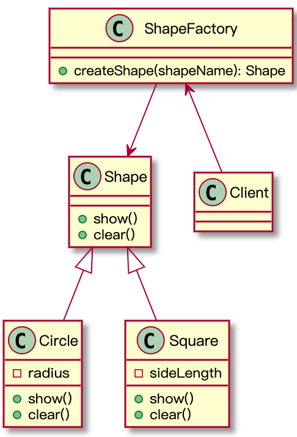

# 简单工厂
## 意图
封装对象的创建过程，调用者只需要知道自己所需对象名称即可。
## 问题
还是以图形的例子，我们有圆形（Circle）、正方形（Square）等，它们是图形（Shape）的子类，我们需要各图形的实例，代码如下：
```Java
public static void main(String[] args){
  Shape shape = new Circle();

}
```
当我需要三角形（Triangle）时，我需要新建一个Triangle类，然后，修改主代码如下：
```Java
  Shape shape = new Triangle();

```
类似这中需要重复创建类的工作，我们可以使用工厂类将这种创建工作进行封装。
## 结构
  

## 代码示例
结合目前的项目，我们有四种贷款产品，分别为抵押贷款（MortgageLoan）、质押贷款（PledgeLoan）、保证贷款（GuaranteeLoan）和信用贷款（CreditLoan），这四种产品的授信方式各不相同，代码如下：
```Java
/**
*贷款产品抽象类（接口）
*/
public interface LoanProduct {
    BigDecimal creditAmount(String prjId);

}
/**
 * @author qinxiaomeng
 * @description 抵押贷款产品
 * @date 2020-06-02
 */
public class MortgageLoan implements LoanProduct {
    @Override
    public BigDecimal creditAmount(String prjId) {
        List list = listCollateral(prjId);
        BigDecimal result = BigDecimal.ZERO;
        for(int i = 0; i < list.size(); i++){
            result = result.add(new BigDecimal(list.get(i).toString()));
        }
        return result;
    }


    private List listCollateral(String prjId){
        List list = new ArrayList();
        //1: 获取项目抵押物列表

        //2:  获取具体抵押物

        //3: 放入list
        list.add(new Integer(1000000));
        return list;
    }
}

/**
 * @author qinxiaomeng
 * @description 质押贷款产品
 * @date 2020-06-02
 */
public class PledgeLoan implements LoanProduct {
    @Override
    public BigDecimal creditAmount(String prjId) {
        return null;
    }
}

/**
 * @author qinxiaomeng
 * @description 保证贷款
 * @date 2020-06-02
 */
public class GuaranteeLoan implements LoanProduct {
    @Override
    public BigDecimal creditAmount(String prjId) {
        return null;
    }
}

/**
 * @author qinxiaomeng
 * @description 信用贷款
 * @date 2020-06-02
 */
public class CreditLoan implements LoanProduct {

    @Override
    public BigDecimal creditAmount(String prjId) {
        int score = score();

        if(score >= 90){
            return new BigDecimal(1000000);
        }else if(score >= 75 && score < 90){
            return new BigDecimal(600000);
        }else if(score > 55 && score < 75){
            return new BigDecimal(100000);
        }
        return BigDecimal.ZERO;
    }

    private int score(){
        return 75;
    }
}

/**
 * @author qinxiaomeng
 * @description 工厂类
 * @date 2020-06-01
 */
public class LoanProductFactory {

    public static LoanProduct createLoanProduct(String loanType){
        switch (loanType){
            case "mortgage":
                return new MortgageLoan();
            case "pledge":
                return new PledgeLoan();
            case "guarantee":
                return new GuaranteeLoan();
            case "credit":
                return new CreditLoan();
            default:
                throw new RuntimeException("不支持该融资产品");
        }
    }
}

/**
 * @author qinxiaomeng
 * @description 客户端类
 * @date 2020-06-02
 */
public class ProjectService {
    public void credit(){
        //LoanProduct product = LoanProductFactory.createLoanProduct("mortgage");
        LoanProduct product = LoanProductFactory.createLoanProduct("credit");
        System.out.println("=====>" + product.creditAmount("123"));
    }

    public static void main(String[] args) {
        new ProjectService().credit();
    }
}
```

## 适用场景
可以预知产品类的数量的创建场景

## 小结
简单工厂，又称静态工厂，适用于可以预知的数量不多的产品类的创建。再添加新产品时，除了要新增产品类，还需要修改工厂方法，以提供新产品的创建，这违反了 **开放-封闭** 原则，这个问题在**工厂方法模式** 可以有效解决。