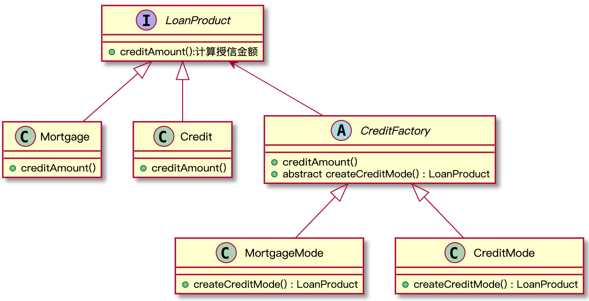

# 工厂方法
## 意图
和简单工厂一样，封装对象的创建过程。不同点是，在父类中定义一个创建对象的接口，然后在子类中做具体实现，由工厂子类决定创建什么对象。
## 问题
我们做的信贷系统，如果我们都是依据抵押品的价值来计算放款金额的，大部分代码都在Mortage抵押类中。后来公司决定做信用贷款，如果我们添加一个 **信用** 类，那就需要修改所有代码，以后每增加一种放款场景，我们都需要改大部分代码。
```Java
class Mortgage {
    public void credit(){
        System.out.println("通过计算抵押物价值得出授信金额");
    }
}

/**
 * 新增内容
 */
class Credit {
    public void credit(){
        System.out.println("通过个人信用评分得出授信金额");
    }
}

/**
 * 客户端角色
 */
public class FactoryMethodCase1 {
    public static void main(String[] args) {
        //Mortgage credit = new Mortgage();
        Credit credit = new Credit();

        credit.credit();
    }
}
```
如果增加一个产品Credit，我们还要修改客户端代码。
## 结构
  

## 代码示例
```Java
interface LoanProduct {
    void creditGranting();
    void showDealStructure();
}

class MortgageLoan implements LoanProduct {

    @Override
    public void creditGranting() {
        System.out.println("根据抵押物授信");
    }

    @Override
    public void showDealStructure() {
        System.out.println("借款人将房产、车辆作为抵押");
    }
}

class CreditLoan implements LoanProduct {

    @Override
    public void creditGranting() {
        System.out.println("根据个人征信评分授信");
    }

    @Override
    public void showDealStructure() {
        System.out.println("信用贷款");
    }
}

abstract class CreditService {
    void credit(){
        LoanProduct lp = createProduct();
        //授信结果
        lp.creditGranting();
        //授信依据
        lp.showDealStructure();
    }


    protected abstract LoanProduct createProduct();
}

class MortgageServce extends CreditService {

    @Override
    protected LoanProduct createProduct() {
        return new MortgageLoan();
    }
}

class PersonCreditService extends CreditService {

    @Override
    protected LoanProduct createProduct() {
        return new CreditLoan();
    }
}

public class FactoryMethod {
    public static void main(String[] args) {
        //CreditService cs = new MortgageServce();
        CreditService cs = new PersonCreditService();

        cs.credit();
    }
}
```
## 疑问
**1. 这个看上去和我直接创建对象没有太大区别？一个是创建对象，一个是创建工厂，那为什么要搞出一个工厂？**

假设我们要添加一种**产品** ，我们要做那些工作？第一步：创建新的产品类；第二步：为产品类创建工厂；这时我们就完成类新产品功能的支持，不需要修改抽象工厂和抽象产品的接口，也不需要修改现有产品的相关代码。也就是说，为产品创建工厂的目的是为了**解偶**，使系统完全符合**开放-封闭**原则。
## 适用场景
相对于简单工厂，工厂方法可以应对产品无限增长的场景，因为工厂方法模式完全符合**开放-封闭**原则，增加产品时仅需要增加产品和对应的工厂类即可。
客户端不知道它所依赖的对象的类：工厂模式中，客户端不需要知道具体的产品类，只需要知道具体的工厂类即可，我们可以把客户端所需要的工厂类保存在配置文件或者数据库。
## 小结
工厂的实现模式是通过继承结构实现的，另外再利用 **多态** 实现工厂方法来创建不同的对象。 

工厂方法模式是简单工厂的进一步抽象和加强，符合开放-封闭原则，使系统具有更好的扩展性。

在工厂方法模式中，核心工厂（抽象工厂）不再负责创建产品，仅仅给出创建产品的接口，产品（对象）的创建过程交给子类（具体的工厂）来完成。  

工厂方法模式最大的优点是扩展性好，增加新产品时无需修改现有系统。缺点是增加新产品时需要增加工厂类，导致系统的类成对的增长；也会增加系统的复杂性，比如：我们把工厂类保存在数据库或者配置文件，然后通过反射来构建工厂对象，使得增加新产品时不需要修改客户端代码。