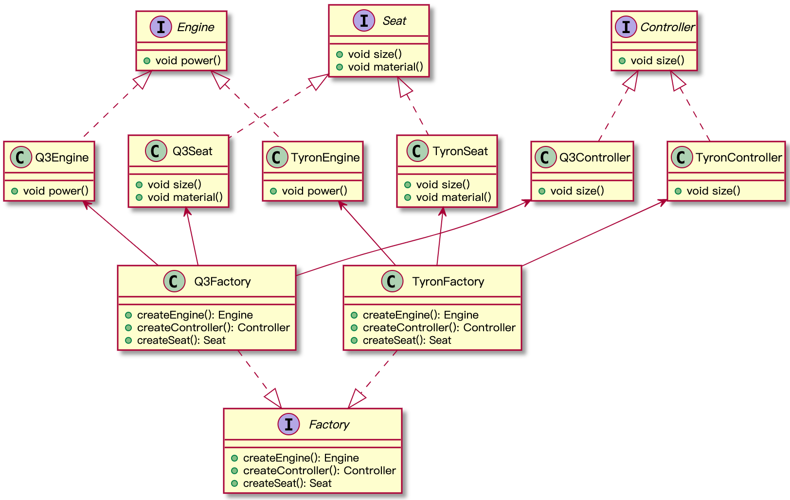

# 抽象工厂
## 工厂模式回顾
通过简单工厂和工厂方法可以体会到，工厂模式的思想就是帮助我们实例化对象，使用工厂方法替换 **new** 操作。这样做的好处就是封装了对象实例化的细节，将对象的创建和使用分开，会给系统带来更大的扩展性。抽象工厂也是一样。
## 意图
可以创建一系列产品（对象），而不需要指定具体的类。
## 问题
抽象工厂模式的意图如何理解？看下兵哥买车的例子，大众探岳和奥迪Q3是同平台生产，假设一台车有底盘、发动机、方向盘和座椅组成，两台车子的这些零件都不一样，如果在生产探岳时，一个工人给它装上Q3的发动机，这个肯定不是我们想要的结果，我们期望在生产探岳时，你给我探岳的一系列零件（产品），生产Q3时就给我一系列Q3的零件。

我们按车辆型号进行分组，就形成了**产品族** 的概念，我们为每个产品族设立一个工厂。

再看一个例子来感受一下**产品和产品族（产品系列）** ，假设我们在做一个家具商场的应用，有一系列相关产品，如：椅子、沙发、电视柜，产品又有不同的变体，比如：现代风格、田园风格、欧式古典等等。

 产品|椅子|沙发|电视柜
-|-|-|-
现代|||
田园|||
欧式古典|||

如果客人买来两把现代的椅子，你给配了一张古典风格的沙发，是不是很奇怪。
## 结构
  

## 代码示例
我们的系统中还没有特别合适的场景来完全体现抽象工厂模式的好处。我们先看一下上面结构图的伪代码：
```java
//抽象产品
interface Engine {
  + void power()
}
interface Controller {
  + void size()
}
interface Seat {
  + void size()
  + void material()
}

//具体产品
class TyronEngine implements Engine{
  + void power()
}

class Q3Engine implements Engine{
  + void power()
}


class TyronController implements Controller {
  + void size()
}
class Q3Controller implements Controller {
  + void size()
}

class TyronSeat implements Seat {
  + void size()
  + void material()
}
class Q3Seat implements Seat {
  + void size()
  + void material()
}
//抽象工厂类
interface Factory {
  + createEngine(): Engine
  + createController(): Controller
  + createSeat(): Seat
}

class TyronFactory extends Factory{
  //生产Tyron的发动机、方向盘和座椅
  + createEngine(): Engine
  + createController(): Controller
  + createSeat(): Seat
}

class Q3Factory extends Factory{
  //生产Q3的发动机、方向盘和座椅
  + createEngine(): Engine
  + createController(): Controller
  + createSeat(): Seat
}

```

## 适用场景
1. 抽象工厂模式适用于系统中需要和**多个**不同系列的相关产品进行交互，但是客户端代码又无法提前预知具体的类型，或者我们处于扩展性考虑，可以适用抽象工厂模式。
2. 或者我们有一个基于一组的抽象方法的类，这个类的作用因此不明确，这种情况也可以考虑使用工厂方法。比如：放款类（Loan）中，需要判断项目属性是否可以放款的方法、放款金额的计算等等

## 小结
抽象工厂模式适用于代码有多个不同系列的产品，相对于工厂方法，添加新产品时，并不需要新增工厂类，比如上面的汽车的例子，如果我们增加一个**大灯**，我们只需要增加一个大灯的产品类即可，不需要新增工厂，但是，这时我们需要修改所有工厂类的方法以创建产品，抽象这种性质我们成为**“开放封闭”**的倾斜性。