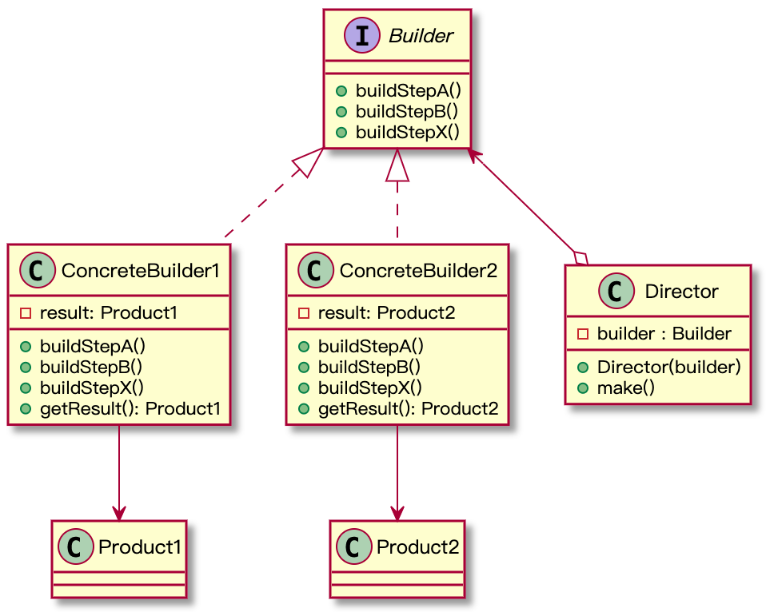

# 生成器模式
## 意图
生成器能够使我们分步骤的创建**复杂**的对象。
## 问题
系统中项目的结构，假设项目包含授信记录、借款方案、产品政策和放款单等等数据，我们要构建这样一个复杂的对象，一般有两种方法，最直接的是使用继承来构建不同内容的项目，这样的话，随着内容的扩充，这个类的层次结构会越来越复杂。如果不希望增加子类的数量，第二种办法就是将这些可预见的参数都写到一个项目类中，然后用一个或多个构造方法来构建对象。
```Java
class ProjectStructure{
  //属性 略

  public ProjectStructure(String prjCode, String custName, String requestAmount){

  }
  public ProjectStructure(String prjCode, String custName, String requestAmount, String productPolciyCode, String productId, String loanSchemeId, float loanRate){
    
  }
}
```
第二种方法虽然不会增加子类的数量，但是复杂的构造方法同样让人难以理解。

## 结构
相关角色：
1. 抽象创建者：Builder
2. 具体创建者：ConcreteBuilder
3. 主管类：Director,这个角色可有可无，客户端也是充当这个角色，调用Builder提供的创建步骤来创建产品
4. 产品类

  

## 代码示例
```Java
/**
 * @author qinxiaomeng
 * @description
 * @date 2020-06-08
 */
interface Builder {
    void setHead(Head head);
    void setBody(Body body);
    void setLeg(Leg leg);
    void setArm(Arm arm);
}

class RobotToysBuilder implements Builder {
    private Head head;
    private Body body;
    private Leg leg;
    private Arm arm;

    @Override
    public void setHead(Head head) {
        this.head = head;
    }

    @Override
    public void setBody(Body body) {
        this.body = body;
    }

    @Override
    public void setLeg(Leg leg) {
        this.leg = leg;
    }

    @Override
    public void setArm(Arm arm) {
        this.arm = arm;
    }

    public RobotToys getResult(){
        return new RobotToys(head, body, leg, arm);
    }
}

class ManualBuilder implements Builder {
    private Head head;
    private Body body;
    private Leg leg;
    private Arm arm;

    @Override
    public void setHead(Head head) {
        this.head = head;
    }

    @Override
    public void setBody(Body body) {
        this.body = body;
    }

    @Override
    public void setLeg(Leg leg) {
        this.leg = leg;
    }

    @Override
    public void setArm(Arm arm) {
        this.arm = arm;
    }

    public Manual getResult(){
        return new Manual(head, body, leg, arm);
    }
}
class RobotToys {
    private Head head;
    private Body body;
    private Leg leg;
    private Arm arm;

    public RobotToys(Head head, Body body, Leg leg, Arm arm){
        this.head = head;
        this.body = body;
        this.leg = leg;
        this.arm = arm;
    }
}

class Manual {
    private Head head;
    private Body body;
    private Leg leg;
    private Arm arm;

    public Manual(Head head, Body body, Leg leg, Arm arm){
        this.head = head;
        this.body = body;
        this.leg = leg;
        this.arm = arm;
    }

    public String print(){
        StringBuffer sb = new StringBuffer();
        sb.append("The Robot toy's head is ").append(head.name()).append("\n")
                .append("body is ").append(body.name()).append("\n")
                .append("leg is ").append(leg.name()).append("\n")
                .append("arm is ").append(arm.name());
        return sb.toString();
    }
}

class Director {
    private  Builder builder;
    public Director(Builder builder){
        this. builder = builder;
    }

    public void make(){
        builder.setBody(Body.operable);
        builder.setArm(Arm.movable);
        builder.setHead(Head.circle);
        builder.setLeg(Leg.normal);
    }
}

enum Head {
    circle, square;
}
enum Body {
    operable, inoperable;
}
enum Leg {
    normal, tyre;
}
enum Arm {
    movable, un_movable;
}
public class BuilderDemo {
    public static void main(String[] args) {
        RobotToysBuilder builder = new RobotToysBuilder();
        new Director(builder).make();
        RobotToys robotToys = builder.getResult();

        System.out.println("build a robot toys:" + robotToys.toString());

        ManualBuilder manualBuilder = new ManualBuilder();
        new Director(manualBuilder).make();

        Manual manual = manualBuilder.getResult();

        System.out.println(manual.print());
    }
}
```

下面我们再看一个非常规的生成器模式，这种方式其实我们经常用到，例如StringBuffer的append(),假设有个类，如下：
```Java
public class User {
    private final String firstName;    //required
    private final String lastName;    //required
    private final int age;    //optional
    private final String phone;    //optional
    private final String address;    //optional
    ...
}
```
有些属性是必须的，有些是可选的，一般我们还是可以通过重载多个构造函数，其中一个构造函数包含必选属性，其他是包括其他属性的变体，如下：
```Java
public class User {
    public User(String firstName, String lastName){
      this.User(firstName, lastname, 0);
    }
    public User(String firstName, String lastName, int age){
      this.User(firstName, lastname, age, "");
    }
    public User(String firstName, String lastName, int age, String phone){
      this.User(firstName, lastname, age, phone, "");
    }
    public User(String firstName, String lastName, int age, String phone, String address){
      this.firstName = firstName;
      this.lastName = lastName;
      this.age = age;
      this.phone = phone;
      this.address = address;
    }
}
```
这样的代码结构肯定是可以满足我们需求的，但是当我们使用一些API看到这样的构造函数，心里肯定说我TM该用哪个。那有没有更优雅的方式能满足我们的需求？接下来我们看一个非常规的生成器模式。

```Java
/**
*从其他文章copy过来的
*/
public class User {
    private final String firstName; // required
    private final String lastName; // required
    private final int age; // optional
    private final String phone; // optional
    private final String address; // optional

    private User(UserBuilder builder) {
        this.firstName = builder.firstName;
        this.lastName = builder.lastName;
        this.age = builder.age;
        this.phone = builder.phone;
        this.address = builder.address;
    }

    public String getFirstName() {
        return firstName;
    }

    public String getLastName() {
        return lastName;
    }

    public int getAge() {
        return age;
    }

    public String getPhone() {
        return phone;
    }

    public String getAddress() {
        return address;
    }

    public static class UserBuilder {
        private final String firstName;
        private final String lastName;
        private int age;
        private String phone;
        private String address;

        public UserBuilder(String firstName, String lastName) {
            this.firstName = firstName;
            this.lastName = lastName;
        }

        public UserBuilder age(int age) {
            this.age = age;
            return this;
        }

        public UserBuilder phone(String phone) {
            this.phone = phone;
            return this;
        }

        public UserBuilder address(String address) {
            this.address = address;
            return this;
        }

        public User build() {
            return new User(this);
        }

    }
}
```

我们获取一个User对象的方式如下：
```java
public User getUser() {
    return new
            User.UserBuilder("Jhon", "Doe")
            .age(30)
            .phone("1234567")
            .address("Fake address 1234")
            .build();
}
```
## 适用场景
1. 构建复杂对象，如果构造方法非常复杂或者需要重载构造方法时，可以考虑使用生成器模式；
2. 我们期望用相同的步骤创建不同类型的对象时，可以使用生成器模式，比如：创建汽车和汽车操作手册，汽车和汽车操作手册是不一样的东西，而且不同的车的操作手册也不相同，这时可以使用生成器模式
## 小结
创建性模式核心都是把对象的创建和使用分离，生成器模式甚至把类的构造方法拿到了类的外面，由**Builder**类完成对象的组装。