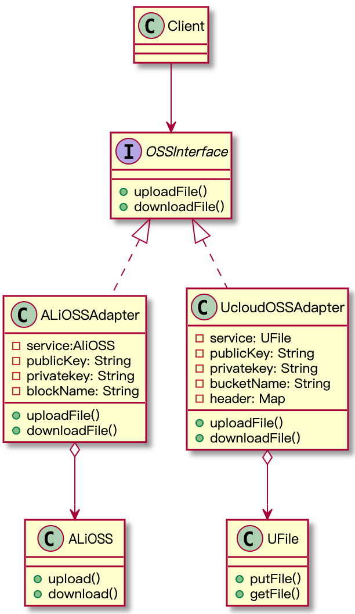

# 适配器模式
## 意图
将原本无法使用的接口，通过封装转换为可以使用的接口。

## 问题
典型案例：方钉打圆孔，利用方钉来打一个圆形孔洞。Adapter模式的使用场景很多，比如：OSS(对象存储)，我可以存在阿里云、华为云、Ucloud等等，假设我们系统一开始实现了本地上传、下载等能力，现在要扩展兼容阿里的OSS，阿里的OSS定义的接口（方法）和我定义的是不一样，我如何使用？同样的场景，短信发送平台的使用，需求希望接入多个平台，可以随时切换。这样的场景我理解为**抄代码**，我借助别人的代码来实现我的能力。只要能转变为**炒代码**的行为，都可以使用适配器模式。

## 结构


## 代码示例
```Java
//>>>>>>适配接口及实现
public interface OSSInterface {

    void uploadFile();
    void downloadFile();
    void delFile();
}

public class AliOssAdapter implements OSSInterface {

    ALiOSS service = new ALiOSS();

    @Override
    public void uploadFile() {
        service.upload();
    }

    @Override
    public void downloadFile() {
        service.download();
    }

    @Override
    public void delFile() {
        service.delete();
    }
}

public class UFileAdapter implements OSSInterface {
    UFile service = new UFile();
    @Override
    public void uploadFile() {
        service.putFile();
    }

    @Override
    public void downloadFile() {
        service.getFile();
    }

    @Override
    public void delFile() {
        service.removeFile();
    }
}
//<<<<<<适配接口及实现
//>>>>>>模拟第三方OSS服务
public class ALiOSS {

    public void upload(){
        System.out.println("上传一份文件到阿里云");
    }

    public String download(){
        System.out.println("从阿里云下载一份文件");
        return "";
    }

    public void delete(){
        System.out.println("从阿里云删除一份文件");
    }

}
public class UFile {

    public void putFile(){
        System.out.println("上传一份文件到Ucloud");
    }

    public String getFile(){
        System.out.println("从Ucloud下载一份文件");
        return "";
    }

    public void removeFile(){
        System.out.println("从Ucloud删除一份文件");
    }
}
//<<<<<<模拟第三方OSS服务

//Client Demo
public class Client {
    public static void main(String[] args) {
        initOS();
        OSSInterface fs = null;

        String ossService = System.getProperty("oss.service");
        if("UFile".equals(ossService)){
            fs = new UFileAdapter();
        }else if("ALi".equals(ossService)){
            fs = new AliOssAdapter();
        }

        fs.uploadFile();
        fs.downloadFile();
        fs.delFile();
    }
    //模拟配置文件内容
    private static void initOS(){
        System.setProperty("oss.service", "UFile");
    }
}
```

## 小结
好处：适配器的好处是显而易见的，当我需要增加或者改变一个适配的方法时不会影响客户端和其他被适配的服务中的代码。完全符合**开放-封闭**原则，灵活性和扩展性都比较好，利用配置文件可以方便的切换适配器。

另外，通过适配器封装了具体的实现，这样对于客户端来讲是透明的，这一点有点像**外观模式**。

缺点：
过多使用适配器会导致系统比较凌乱，难以理解，比如：我明明调用的是接口A，最终被调用的是接口B