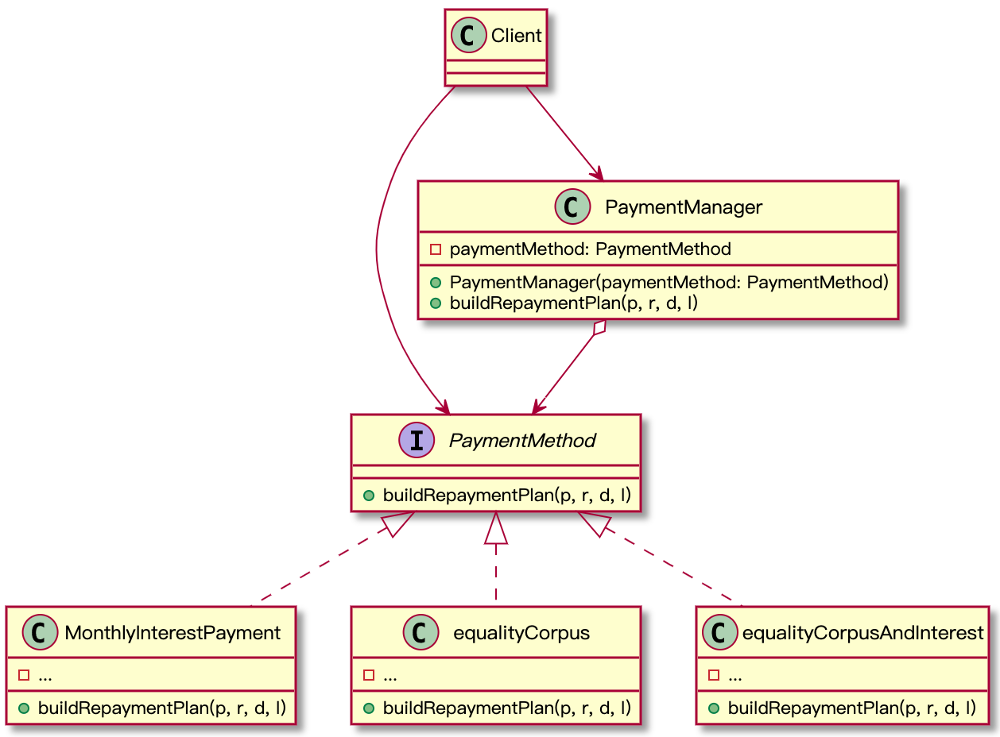

# 策略模式
## 意图
它能让你定义一系列算法，没种算法用单独的类实现，并且能够使算法的对象项目替换。

## 问题
实际场景，如：还款方式有“按月付息，到期还本”、“等额本金”、“等额本息”等等，如果我们用一个还款计划的类（RepaymenPlan）来实现，我们每增加一个还款方式或者修改某一个还款方式的条件都会影响整个类，从而增加了在已有正常运行代码中引入BUG的风险。

## 结构
  

## 代码示例
```Java
interface PaymentMethod {
    void buildRepaymentPlan(BigDecimal p, BigDecimal r, Date d, int l);
}

class MonthlyInterestPayment implements PaymentMethod {

    @Override
    public void buildRepaymentPlan(BigDecimal p, BigDecimal r, Date d, int l) {
        System.out.println("按月付息算法");
    }
}

class EqualityCorpus implements PaymentMethod {

    @Override
    public void buildRepaymentPlan(BigDecimal p, BigDecimal r, Date d, int l) {
        System.out.println("等额本金算法");
    }
}

class EqualityCorpusAndInterest implements PaymentMethod {
    @Override
    public void buildRepaymentPlan(BigDecimal p, BigDecimal r, Date d, int l) {
        System.out.println("等额本息算法");
    }
}

class PaymentManager {
    private PaymentMethod paymentMethod;

    public PaymentManager(PaymentMethod paymentMethod){
        this.paymentMethod = paymentMethod;
    }

    public void buildRepaymentPlan(BigDecimal p, BigDecimal r, Date d, int l){
        paymentMethod.buildRepaymentPlan(p, r, d, l);
    }
}

/**
 * Client
 */
public class StrategyDemo {
    public static void main(String[] args) {
        PaymentMethod method = getMethodByType(2);
        PaymentManager pm = new PaymentManager(method);
        pm.buildRepaymentPlan(new BigDecimal(100000), new BigDecimal(13.8), new Date(), 12);
    }

    private static PaymentMethod getMethodByType(int type){
        switch (type){
            case 1:
                return new MonthlyInterestPayment();
            case 2:
                return new EqualityCorpus();
            case 3:
                return new EqualityCorpusAndInterest();
            default:
                throw new RuntimeException("不支持的付款方式");
        }
    }
}
```

## 适用场景
1. 有多种算法的变体，不同算法可以任意切换，如：上述的还款方式，还有使用什么类型消息通知，短信 or 微信；
2. 代码中使用了复杂的条件判断，个人觉得超过四重的条件判断就可以考虑把这段代码重构了。